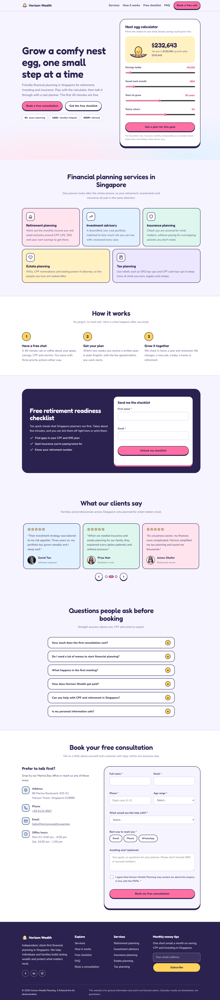
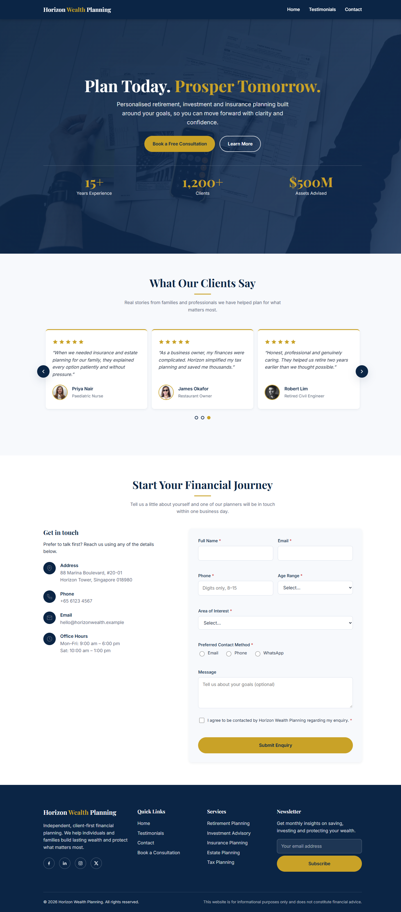

# Horizon Wealth Planning

A one-page marketing site for the fictional "Horizon Wealth Planning" firm, offering retirement, investment and insurance planning. Two versions are published side by side for comparison.

| Version | Live demo | Source |
| --- | --- | --- |
| v1 (original) | https://ericpang.github.io/financial/ | [`index.html`](index.html) |
| v2 (revamp) | https://ericpang.github.io/financial/v2/ | [`v2/index.html`](v2/index.html) |

## v2: SEO, security, mobile and lead generation



- **Lead magnets**: an interactive nest egg calculator in the hero (with a growing egg), a free retirement readiness checklist unlocked by email (tickable and printable as a PDF), a once-per-session checklist nudge, and a sticky "Free checklist / Book free call" bar on mobile. The calculator's call to action pre-selects retirement planning in the enquiry form.
- **SEO and AEO**: keyword-focused title and description, canonical URL, Open Graph and Twitter cards with a 1200×630 image (`v2/og.png`), `en-SG` locale, JSON-LD (`FinancialService`, `WebSite`, `FAQPage`), a visible FAQ that mirrors the schema, a services section, a semantic heading outline and `sitemap.xml`.
- **Security hardening**: a strict Content Security Policy (`default-src 'none'`, inline script and style allowed only by SHA-256 hash, `form-action 'none'`, `base-uri 'none'`), a strict referrer policy, frame-busting, no `innerHTML` (all user input is rendered with `textContent`), length limits and control-character stripping on inputs, honeypot fields and a minimum fill time against bots, and `rel="noopener noreferrer"` on external links.
- **Mobile and design**: mobile-first layout tested at 390px with no horizontal scroll, 44–50px tap targets, safe-area insets, a pastel "sticker" style with Fredoka and Nunito, visible focus rings, a skip link and `prefers-reduced-motion` support.
- Testimonials carousel, a three-step "how it works" section, an enquiry form with validation and a newsletter sign-up, as in v1.

After editing the `<style>` or `<script>` block in `v2/index.html`, regenerate the CSP hashes, or the browser will block them:

```
python tools/update-csp.py
```

## v1: original



- Hero section with animated count-up stats (years of experience, clients, assets advised)
- Testimonials carousel (3 cards per view on desktop, with dot navigation)
- Enquiry form with client-side validation, including a preferred-contact-method radio group
- Newsletter sign-up form
- Scroll-reveal animations
- Responsive, mobile-first layout with a desktop navigation

## Tech notes

- Each version is a single HTML file with CSS in a `<style>` tag and JS in a `<script>` tag.
- No framework, build step, package manager or dependencies.
- Remote assets: Google Fonts and pravatar.cc (v1 also loads an Unsplash photo).
- GitHub Pages can't set HTTP headers, so v2's security policy is delivered with `<meta>` tags. `frame-ancestors`, HSTS and `Permissions-Policy` need real headers (for example from a CDN) if the site moves to a custom host.

## Run locally

Serve the repo root, then open `http://localhost:8000/` (v1) or `http://localhost:8000/v2/` (v2):

```
python -m http.server
```

## Deployment

A GitHub Actions workflow (`.github/workflows/pages.yml`) deploys both versions to GitHub Pages on every push to `main`.

## Demo only

The enquiry, checklist and newsletter forms are demo-only. Submissions are validated in the browser and logged to the console; nothing is sent to a server.
